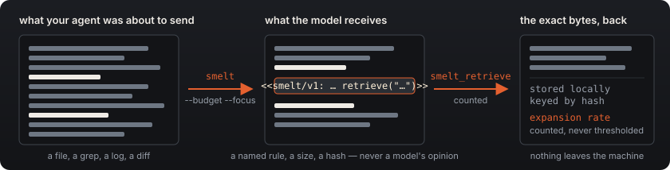

<div align="center">


**Structure-aware, reversible context optimization for coding agents.**
A library, not a proxy.

[](https://github.com/smeltjs/smelt/actions/workflows/ci.yml)
[](#the-four-laws)
[](#requirements)
[](./LICENSE)

[Setup guide](docs/SETUP.md) · [Architecture](docs/ARCHITECTURE.md) · [Vocabulary](CONTEXT.md) · [Changelog](CHANGELOG.md) · [Skill](skills/smelt/SKILL.md) · [llms.txt](llms.txt)

</div>

```sh
npm install -g @smeltjs/core && smelt setup      # or: brew install smeltjs/tap/smelt
```

**Measured, in three numbers** — every row in [`bench/RESULTS.md`](packages/core/bench/RESULTS.md), logs committed:

| tokens sent, nine-case corpus                                                                     | expansion rate, whole-file tasks                                                                                                               | answer quality, A/B against raw                                                                                                                                                                                                    |
| :------------------------------------------------------------------------------------------------ | :--------------------------------------------------------------------------------------------------------------------------------------------- | :--------------------------------------------------------------------------------------------------------------------------------------------------------------------------------------------------------------------------------- |
| **−80%** · 109,348 → 21,696                                                                       | **0.94** · 17 of 18 blobs asked back                                                                                                           | **6 ties** · 2 raw better · 1 smelted better\*                                                                                                                                                                                     |
| Counted on the model's own tokenizer. _tier 2 · claude-opus-5 · 2026-09-07 · corpus 10462aa46b8e_ | The over-pruning alarm ringing where it should: 8 of 9 cases retrieved everything. _tier 3 · claude-opus-5 · 2026-09-07 · corpus 10462aa46b8e_ | Judged blind, one run, a model's opinion. \*The one "smelted better" is an artifact — [why](#tier-4--answer-quality--ab-one-judged-run-verdicts-are-a-models-opinion). _tier 4 · claude-opus-5 · 2026-09-07 · corpus 10462aa46b8e_ |

## What it does

**smelt shrinks what your coding agent sends to a model, without lying about what it
removed.**

<div align="center">

</div>

Hand it a blob of text — a file, a grep result, a stack trace, a build log — and a byte
budget. You get back a smaller blob in which the parts the task needs survive, and
everything else has been replaced by a single line saying what went, how big it was, and a
hash to get it back:

```
<<smelt/v1: collapsed 3 sibling functions (2224B) — retrieve("84998967370f38bc")>>
```

The removed bytes are kept locally, content-addressed. The model gets a `smelt_retrieve`
tool. **Every retrieval is counted**, so cutting too much shows up as a rising number
rather than as a model that is quietly wrong about your code. It is the shape Anthropic's own
[context-engineering guidance](https://www.anthropic.com/engineering/effective-context-engineering-for-ai-agents)
describes — lightweight identifiers, loaded on demand through tools — with every reference
explained, reversible, and counted.

| What your agent does today                         | What smelt does instead                                                           |
| -------------------------------------------------- | --------------------------------------------------------------------------------- |
| Sends the whole 40 kB file, or its first 200 lines | Keeps the declarations your focus matched, with their signatures and doc comments |
| `[...output truncated...]`                         | `<<smelt/v1: collapsed 3 sibling functions (2224B) — retrieve("8499…")>>`         |
| Truncated content is gone                          | Stored locally, keyed by hash, one tool call away                                 |
| No idea whether the cut hurt                       | An expansion rate you can watch move                                              |
| Asks a hosted model which lines matter             | Never leaves the machine                                                          |

## Sixty seconds, from a shell

`smelt <file> --budget <bytes> --focus <term>` reads a file or stdin; the smelted text goes to
stdout and the report to stderr, so the two pipe apart. A real run on this repository's own
source — regenerated from the built binary by a guard on every `pnpm verify`, so it is this
build's output and not a past release's:

```
smelt packages/core/src/plan/lexical.ts --budget 4000 --focus planLexical
```

```
smelt  packages/core/src/plan/lexical.ts  typescript  lexical/v1
in 7,328 B → out 988 B   (-86.5%, 3 elisions)
focus  planLexical

  rule          lines  bytes  hash              explanation
  focus-window     48  2,057  9cabfea303a9dad2  collapsed 48 lines with no match for the focu…
  focus-window     11    756  c35d231379780e11  collapsed 11 lines with no match for the focu…
  focus-window    119  3,857  2a00ebd8bd7e58df  collapsed 119 lines with no match for the foc…
```

At the end of a session the store reports on itself — what it holds, the expansion rate,
the counters, then the ledger, one rule at a time. Also regenerated from the binary, after
smelting that file with `--strategy auto` and retrieving one of the two markers:

```
smelt stats  /your/project/.smelt/store
2 blobs, 4.0 KB on disk

  expansion  ████████████░░░░░░░░░░░░  50.0%   1 of 2 elisions asked for back

  elisionsStored            2
  bytesStored           4,146
  retrieveCalls             1
  uniqueRetrieved           1
  misses                    0
  expansionRate           0.5
  allElisionsRetrieved  false

  rule              stored  retrieved   rate
  sibling-collapse       2          1  50.0%
```

`expansionRate` is the fraction of what smelt hid that the model asked for back — the honest
signal of over-pruning, measured and never thresholded. In a pipe, in CI or under `NO_COLOR`
the output is exactly these bytes; `--json` is the surface to parse.

- **`--strategy`**: `lexical` (default) uses focus windows, right for logs and traces;
  `structural` collapses whole sibling declarations and keeps every signature and doc comment;
  `json` and `diff` cut by members and hunks; `auto` picks by content kind, then language, and
  labels what it ran. Every structural cut carries an **outline** of the names behind the marker.
- **`--json`** prints a versioned envelope; **`--reconstruct`** reads it back, byte for byte.
- **`smelt map <dir> --budget 4000`** — a ranked symbol map of a whole repository, fitted to the
  budget by construction; modelled on Aider's repo-map, credited as such.
- **`smelt agents lint`** — nine advisory, cited rules over the other blob an agent loads on
  every request, your `AGENTS.md` ([guide](docs/SETUP.md#smelt-agents--the-file-that-loads-on-every-request)).
- Exit codes: `1` over budget, `2` usage, `3` refused, `4` unexpected.

## Install

```sh
npm install -g @smeltjs/core
brew install smeltjs/tap/smelt
```

As a library, `npm install @smeltjs/core` (pnpm, bun and yarn work too); without installing
anything, `npx @smeltjs/core src/server.ts --budget 4000 --focus handleRequest`.

One runtime dependency (`web-tree-sitter`); the parsers ship inside the tarball. No native
build step, no post-install download, no Docker, no service, no API key.

## Setup in one command

```sh
smelt setup
smelt doctor
```

Interactive from a terminal, Enter accepting every default, `smelt setup` applies the whole
recipe: `smelt.config.json`, the hooks preset for the harnesses it detects, the MCP
registration for Claude Code, opencode, Codex and Grok, and a real smelt → retrieve round trip
to prove the loop. An existing file is **merged**, never overwritten. `smelt doctor` reads that
install back, **runs** every hook it finds against an oversized file, proves the round trip in
a throwaway store, and exits 3 with the repair command named when anything is behind. For an
agent or CI, the whole interface is flags:

```sh
npx @smeltjs/core setup --yes --harness claude-code --json
smelt setup --yes --scope user --map on --lint on    # one config and one store for the whole machine
```

The hooks are one zero-dependency guard core behind thin per-harness shims: a **size-guard**
that refuses raw reads over a threshold and names the exact `smelt` replacement, **stats on
Stop**, and opt-in **repo map** and **instruction-file lint** at session start. Deny-with-reason
by default; rewrite is opt-in and always announced. Harnesses are tiered honestly, in a table a
guard holds to the registry:

| Tier         | Harnesses                                     | What the tier means                                                                        |
| ------------ | --------------------------------------------- | ------------------------------------------------------------------------------------------ |
| verified     | Claude Code, Codex                            | hook schema verified against primary docs and pinned by recorded fixtures                  |
| experimental | Gemini, Grok, Hermes, Cursor, opencode, Cline | schema mapped from the capability matrix, **not yet smoke-tested against the real binary** |
| advisory     | KiloCode, Aider                               | no usable hook API — instructions only, and nothing enforces them                          |

Scope, upgrades, the Homebrew probe, every hook's behaviour, the MCP server and the reranker
opt-in: [`docs/SETUP.md`](docs/SETUP.md).

## For agents

**AI agents / LLMs:** read [`llms.txt`](llms.txt) — the summary, the four laws, the three
commands and the five MCP tool names, with links to everything else — or fetch
[`llms-full.txt`](https://smeltjs.github.io/smelt/llms-full.txt) for all of it in one blob.
Both are rendered by `pnpm generate:llms-txt`, never hand-written.

There are exactly **two instruction channels**, both rendered from one
[SetupRecipe](docs/SETUP.md#one-command-smelt-setup) ([ADR-0002](docs/adr/0002-skill-pack-complements-marker-blocks.md)):
the **marker block** `smelt setup` writes beside the hooks, and the
**[SkillPack](skills/smelt/SKILL.md)**, a router whose root is what an agent mid-task needs
(read, retrieve, map, obey a guard denial, the MCP names), with setup, the store and the
reranker one link away. An agent's owner installs it with:

```sh
npx skills add smeltjs/smelt
```

[`@smeltjs/mcp`](packages/mcp/README.md) serves the same library as a stdio MCP server —
`smelt_file`, `smelt_retrieve`, `smelt_retrieve_batch`, `repo_map`, `smelt_stats` — over the
store the CLI uses, so a shell `smelt retrieve` and the model's tool call move one set of
counters. What it says before a model has asked anything is held under a byte ceiling by a guard.

```sh
claude mcp add smelt -- npx @smeltjs/mcp
```

## The library

```ts
import { createSmelter, DirectoryElisionStore } from '@smeltjs/core';

const smelter = createSmelter({
  defaultBudgetBytes: 8_000,
  store: new DirectoryElisionStore('.smelt/store'), // content-addressed, crash-safe, prune-only
});

// 1. Shrink tool output on its way to the model.
const result = await smelter.smelt(toolOutput, {
  path: 'src/server.ts', // language detection
  focus: ['handleRequest'], // what you were actually looking for
  budgetBytes: 4_000,
  strategy: 'structural', // parse-tree collapse; 'lexical' for non-code, 'auto' to pick
});
result.text; // send this
result.elisions; // what was cut: rule, explanation, bytes, hash — per elision
result.outputBytes; // the budget is a target, never a silent guarantee

// 2. Give the model the way back: a normal tool, 'smelt_retrieve', exact bytes out.
const { name, description, inputSchema, invoke } = smelter.tool;

// 3. Watch whether you cut too much.
smelter.stats().expansionRate; // 0 = the model never needed anything back
```

Three things that look like bugs and are not: **`budgetBytes` is required** unless your config
sets a default — a budget smelt invented would be smelt deciding how much of your context to
throw away; **an unsupported language under `structural` is refused**, never approximated
(`auto` makes the choice and says which planner ran); and **there is no expansion-rate
threshold** — smelt measures, policy is yours. **Budgets are UTF-8 bytes, permanently**: the
only unit computable locally for every model, and one that does not redefine itself between
model generations; pass a `measure` and the result also carries your own unit, labelled with the
tokenizer that produced it ([why](docs/ARCHITECTURE.md#decision-1--budgets-are-utf-8-bytes-permanently-in-the-core)).

`createSmelter({ planner })` accepts any `Planner`; `RerankStage` is the seam for relevance, and a
**[reranker is opt-in and you write it down](docs/SETUP.md#reranking-a-seam-and-an-opt-in-you-write-down)** —
no default, nothing loaded without a `rerank` key in your config, and the one adapter that reaches
the network is a separate package the zero-network guard forbids as an import. Wiring a harness of
your own: [three steps](docs/SETUP.md#wiring-the-library-into-a-harness-of-your-own).

## Measured numbers

From the committed measurement harness (`pnpm bench`). Each tier's rows come from the last
run that measured it, and say so: tier 1 from run 2026-09-07 on corpus `19b11585126f`
(eleven cases — this repo's own planner source, real tool outputs, byte-exact files from
django, scikit-learn and sympy at pinned upstream commits, and two content-kind probes);
tiers 2–4 from run 2026-09-07 on corpus `10462aa46b8e` (the nine cases before the probes
were added), tiers 3–4 run once on `claude-opus-5`, their logs committed beside the rows ([`bench/RESULTS.md`](packages/core/bench/RESULTS.md),
append-only; [`tier3-log/`](packages/core/bench/tier3-log/), [`ab-log/`](packages/core/bench/ab-log/)).

### Tier 1 — bytes · deterministic, offline · corpus `19b11585126f`

| case                           | planner       |      in (B) |    out (B) | reduction           |
| ------------------------------ | ------------- | ----------: | ---------: | ------------------- |
| large TS file                  | structural/v1 |      35,458 |     11,324 | −68.1%, over budget |
| TSX component                  | structural/v1 |       1,090 |        861 | −21.0%, over budget |
| java classes                   | structural/v1 |         689 |        366 | −46.9%              |
| multi-file grep                | lexical/v1    |       6,451 |        986 | −84.7%              |
| stack trace                    | lexical/v1    |         452 |        344 | −23.9%              |
| build log (labelled synthetic) | lexical/v1    |      16,354 |        109 | −99.3%              |
| django query_utils             | structural/v1 |      13,389 |      1,697 | −87.3%              |
| sklearn _ridge                 | structural/v1 |      91,082 |     31,951 | −64.9%              |
| sympy boolalg                  | structural/v1 |     114,180 |      8,151 | −92.9%              |
| git diff (content-kind probe)  | diff/v1       |       4,132 |      2,706 | −34.5%, over budget |
| JSON log (content-kind probe)  | json/v1       |      11,447 |      3,280 | −71.3%, over budget |
| **corpus total**               |               | **294,724** | **61,775** | **−79.0%**          |

The two probe rows are the honest trade the kind planners make: more bytes than the lexical
planner left on the same input (1,516 B and 2,996 B, earlier rows, same corpus), in exchange for
every file and hunk header of the diff and the JSON skeleton with an outline of every hidden key.

### Tier 2 — tokens · `count_tokens` on `claude-opus-5`

| case               |    in (tok) |  out (tok) |  reduction |
| ------------------ | ----------: | ---------: | ---------: |
| large TS file      |      11,768 |      4,036 |     −65.7% |
| TSX component      |         429 |        353 |     −17.7% |
| java classes       |         256 |        172 |     −32.8% |
| multi-file grep    |       2,835 |        426 |     −85.0% |
| stack trace        |         196 |        148 |     −24.5% |
| build log          |       9,090 |         58 |     −99.4% |
| django query_utils |       4,534 |        577 |     −87.3% |
| sklearn _ridge     |      34,962 |     12,365 |     −64.6% |
| sympy boolalg      |      45,278 |      3,561 |     −92.1% |
| **corpus total**   | **109,348** | **21,696** | **−80.2%** |

### Tier 3 — the expansion rate · the honest signal, and it rang

Aggregate **0.94**: asked to _"read this file to understand X before editing it"_, the model
retrieved **17 of 18** elided blobs back — a LOSS on 8 of 9 cases (the stack trace retrieved
none). That is the alarm working, not the product failing: whole-file comprehension is the one
task shape that genuinely needs everything, and smelt exists to make that visible instead of
silent. On the question-shaped reads of tier 4, the same model retrieved 0–2.

### Tier 4 — answer quality · A/B, one judged run, verdicts are a model's opinion

| case               | raw in (tok) | smelted in (tok) | retrieves | verdict          |
| ------------------ | -----------: | ---------------: | --------: | ---------------- |
| large TS file      |       11,820 |            4,671 |         0 | tie              |
| TSX component      |          472 |            2,300 |         1 | tie              |
| java classes       |          296 |            2,050 |         2 | smelted better\* |
| multi-file grep    |        2,886 |            5,091 |         2 | raw better       |
| stack trace        |          232 |            1,748 |         1 | tie              |
| build log          |        9,138 |           10,597 |         1 | raw better       |
| django query_utils |        4,584 |            1,210 |         0 | tie              |
| sklearn _ridge     |       35,024 |           49,082 |         2 | tie              |
| sympy boolalg      |       45,322 |           15,024 |         2 | tie              |

Six ties, two raw-better, one smelted-better. **Quality held** on answerable questions, at a
fraction of the input where nothing was retrieved. **Round trips re-bill**: each retrieve re-sent
the transcript, and on 5 of 9 cases the smelted arm's summed input exceeded the raw arm's —
retrieval is the cost lever, which is exactly why smelt counts it and refuses to threshold it for
you. \* The one "smelted better" is an artifact: that raw arm returned an empty answer (0 output
tokens; the judge's committed reasons say so). Reported as measured, with the caveat here.

What these are: measured bytes, measured tokens on a named tokenizer, counted `smelt_retrieve`
calls, one judged A/B run — every row reproducible or committed. What they are **not**: dollar
savings (no price table is committed), rates from real agent traffic (tier 3 is a lab task chosen
to ring the alarm), or a claim beyond this corpus. The nearest real-traffic comparable remains
**Headroom's stated 21–57% across its four proof scenarios** (their README, 2026-09) — their
numbers, on their corpus, cited as exactly that.

## What is in the box

- **[Structural planner](docs/ARCHITECTURE.md#the-structural-planner)** — bundled tree-sitter
  grammars for **fifteen languages** (`typescript`, `tsx`, `javascript`, `rust`, `python`, `go`,
  `java`, `c`, `cpp`, `c_sharp`, `ruby`, `php`, `kotlin`, `swift`, `bash`); keeps focus-matched
  declarations whole and collapses sibling runs into markers that name kind and count.
- **Lexical planner** — focus windows, head-tail, a context ladder under budget pressure. For
  logs, traces, and every other blob that is not code.
- **[Persistent store](docs/ARCHITECTURE.md#the-persistent-store)** — one file per content hash,
  atomic writes, bytes re-verified on read, counters in an append-only journal. **No automatic
  eviction, ever**; the one deletion is `smelt store prune`, which you type and which journals
  every eviction so a later retrieve says `EvictedHashError` with the date.
- **[Repo-map planner](docs/ARCHITECTURE.md#the-repo-map)** — tree-sitter tags, deterministic
  PageRank, a caller-owned cache; every included symbol can say why it ranked.
- **[Cache-prefix hygiene](docs/ARCHITECTURE.md#cache-prefix-hygiene)** — where two prompt
  prefixes diverge and which silent cache-breakers to fix. **Detect and warn only.**
- **[The setup surface](docs/SETUP.md)** — `smelt setup`, `smelt doctor`, `smelt hooks install`,
  `smelt agents lint`; the recipe's facts live as data, every rendering of them guard-pinned.
- **[The honesty machinery](docs/ARCHITECTURE.md#the-honesty-machinery)** — a guard per law and
  per guarantee, and a mutation runner (`pnpm mutate`) that breaks the source on purpose and
  fails if a guard does not notice; its last tally is committed in [`guards.json`](guards.json).

## The four laws

The reasoning — _why_ breaking each produces a library that still looks like it works — is in
[`docs/ARCHITECTURE.md`](docs/ARCHITECTURE.md#the-four-laws-and-why-each-one-is-load-bearing):

1. **Zero network.** No external calls in any code path, enforced by a guard that walks the
   real import graph — and names the one opt-in adapter package **forbidden** as an import.
2. **Every elision is explainable.** A named rule and a sentence a human can read in a diff.
3. **Every elision is reversible, and expansions are counted.** Reversibility without
   counting is how "90% reduction" gets claimed while the model quietly asks for all of it back.
4. **Claim no number that has not been measured.** Which is why the numbers above are tables
   with a date and a corpus commit, not a headline.

Two stability promises follow. **The wire surface a model sees is stable from 0.1 and treated
as 1.0** — the `<<smelt/v1: … >>` marker and the `smelt_retrieve` contract; a future format
arrives as `smelt/v2`, never as a quiet substitution. **The TypeScript API is `0.x` and may
move**; snapshot the properties, not the exact elisions.

## Requirements

**Node** `^20.19 || >=22.12` — the range where Node loads ES modules through `require()`
without a flag, so `@smeltjs/core` (an ESM package) works from CommonJS too. **pnpm** 10.15
for development only. Nothing else: no database, no Docker, no compiler, no API key.

## Prior art, credited honestly

smelt's architecture is **close to Headroom's**, and it would be dishonest to imply otherwise.

- **[Headroom](https://github.com/headroomlabs-ai/headroom)** — the closest peer: a Rust core
  behind Python and TS SDKs, a proxy wrapping sixteen-odd agents, a trained model in the prose
  cut path, TTL-expiring retrieval, telemetry on by default. smelt's shape started from its early
  Python form, and its CacheAligner's detect-don't-rewrite decision is copied here outright. If
  you want a proxy today, use Headroom ([survey, 2026-09](docs/research/2026-09-06-peer-tools-survey.md)).
- **[Aider's repo-map](https://aider.chat/2023/10/22/repomap.html)** — the prior art the
  repo-map planner is modelled on: tree-sitter tags + PageRank + a budget + a cache.
- **[LLMLingua](https://github.com/microsoft/LLMLingua)** — prompt-compression research; its
  numbers are on non-code benchmarks. **[SweRank](https://arxiv.org/abs/2505.07849)**,
  **[LocAgent](https://arxiv.org/abs/2503.09089)**, **[Agentless](https://github.com/OpenAutoCoder/Agentless)**
  — learned code localization, a v2 conversation because each puts a model in the retrieval path.
- **[Tree-sitter](https://tree-sitter.github.io/)** — the parsers under all of it.

**What smelt adds**: the **zero-network guarantee**, guard-enforced and claimed by no peer;
**every elision explaining itself**; retrieval **reversible without eviction and counted** —
the expansion rate, which no peer reports; and the **mutation-tested honesty machinery** that
makes these claims checkable instead of aspirational.

## Documentation

| Doc                                                            | What is in it                                                                                                     |
| -------------------------------------------------------------- | ----------------------------------------------------------------------------------------------------------------- |
| [`docs/SETUP.md`](docs/SETUP.md)                               | The operator guide: setup, scope, upgrades, every hook, the MCP server, `smelt agents`, the reranker opt-in       |
| [`docs/ARCHITECTURE.md`](docs/ARCHITECTURE.md)                 | The deep dive: the four laws and their reasoning, the architecture file by file, the consumer contract, decisions |
| [`CONTRIBUTING.md`](CONTRIBUTING.md)                           | Dev setup, the guard/mutation convention, the recorded transcript of the zero-network guard going red             |
| [`packages/core/bench/`](packages/core/bench/)                 | The measurement harness: corpus, tiers, and the append-only results table                                         |
| [`docs/research/`](docs/research/)                             | Dated primary-source surveys: harness capability, peer tools, platform context economics, README design           |
| [`packages/core/THIRD-PARTY.md`](packages/core/THIRD-PARTY.md) | Generated attribution for the bundled grammars. Never hand-edited; a stale copy fails `pnpm test`.                |
| [`assets/PALETTE.md`](assets/PALETTE.md)                       | The palette, the marks, and how to regenerate the rasters                                                         |

## Contributing

Contributions welcome — planners, languages, docs, and especially benchmark corpus cases.
Read [`CONTRIBUTING.md`](CONTRIBUTING.md) first: dev setup is `pnpm install && pnpm verify`,
and the convention around _guards that can fail_ is the part that matters. Conventional Commits.

## License

[Apache-2.0](./LICENSE). The consumer contract — the stable surface and the guarantees any
consumer can rely on — is in [`docs/ARCHITECTURE.md`](docs/ARCHITECTURE.md#the-consumer-contract).

<div align="center">
<br />

<br />
<sub>Cut hard. Explain everything. Keep the ore.</sub>
</div>
